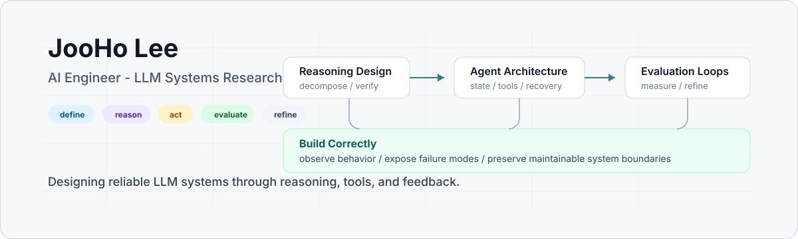

<p align="center">
  
</p>

# JooHo Lee

AI engineer and researcher working on LLM systems, agent architecture, reasoning workflows, and evaluation design.

I work on systems where model capability is only one part of the problem. The rest is task definition, system boundary, failure visibility, and evidence of improvement.

## Focus Map

```text
Problem Framing
  -> Reasoning Design
  -> Agent Architecture
  -> Evaluation Loops
  -> Tool-use Reliability
  -> Maintainable Systems
```

Prompts, tools, memory, orchestration, and evaluation are treated as one system. I prefer designs that can be explained, tested, debugged, and improved without relying on intuition alone.

## Working Areas

- Agent loops with explicit state, tools, recovery, and feedback
- Evaluation pipelines for reasoning-heavy and failure-prone workflows
- Context, memory, and retrieval designs that remain inspectable
- Tool-use reliability across planning, execution, validation, and recovery
- Human-in-the-loop systems where uncertainty is surfaced, not hidden
- Research-to-implementation loops that preserve both experimental flexibility and engineering discipline

## Engineering Principles

- Measure behavior before trusting capability.
- Make assumptions and failure modes visible.
- Design evaluation loops before scaling a workflow.
- Keep architectures simple until complexity is justified.
- Optimize for correctness, maintainability, and evidence, not only speed.
- Build systems that can improve through inspection and iteration.

## Selected Repositories

- [`Transformer-Implementation-Pytorch`](https://github.com/BWAAEEEK/Transformer-Implementation-Pytorch): educational PyTorch implementation of the Transformer architecture
- [`BERT_pytorch`](https://github.com/BWAAEEEK/BERT_pytorch): minimal PyTorch implementation and experiments with BERT-style language modeling
- [`NeuroMarketing-with-GNN`](https://github.com/BWAAEEEK/NeuroMarketing-with-GNN): graph neural network experiments for neuromarketing and behavior prediction
- [`Neural_Collaborative_Filtering`](https://github.com/BWAAEEEK/Neural_Collaborative_Filtering): PyTorch implementation of neural collaborative filtering for recommendation tasks
- [`FontRecSys`](https://github.com/BWAAEEEK/FontRecSys): font recommendation experiments using machine learning and representation learning
- [`Blog_post_embedding`](https://github.com/BWAAEEEK/Blog_post_embedding): data collection and semantic embedding experiments for blog post representation

## Contact

- GitHub: [@BWAAEEEK](https://github.com/BWAAEEEK)
